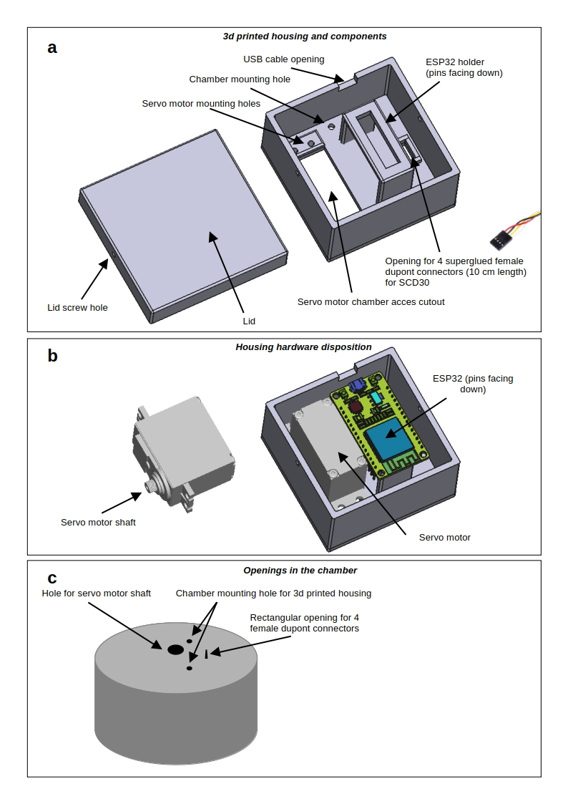

# IoT-AC: Internet of Things - Accumulation Chamber

This project provides the documentation and source files to build a low-cost, IoT-based accumulation chamber (**IoT-AC**) for measuring diffuse $CO_2$ fluxes.

## Overview
The **IoT-AC** is designed for environmental monitoring, with a focus on soil and volcanic degassing. The system leverages an ESP32 microcontroller to manage gas sensing and internal air homogenization, offering a portable, cost-effective alternative to professional scientific instrumentation.

## Hardware Components

### Electronics
* **Microcontroller:** [ESP32](https://www.espressif.com/en/products/socs/esp32) (Dual-core, Wi-Fi/Bluetooth enabled).
* **CO2 Sensor:** [Sensirion SCD30](https://sensirion.com/products/catalog/SCD30) – A high-precision NDIR (Non-Dispersive Infrared) module.
* **Fan Motor:** Parallax Inc. bidirectional continuous rotation servomotor (0-50 RPM, 4.6 V).

### Chamber Specifications
We recommend using a **4-litre aluminium chamber** (e.g., a commercially available rice cooker pot) for the following reasons:
* **Dimensions:** ~20 cm internal diameter, 13 cm height.
* **Material:** Lightweight and durable.
* **Machining:** Easy to drill for mounting components.

> **Note:** Internal air homogenization is critical in closed-chamber systems to maintain a uniform concentration gradient. The integrated fan ensures this without disturbing the soil interface.

<figure>
  
  <figcaption>Figure 1: Description of the IoT-AC 3D-printed housing.</figcaption>
</figure>

---

## Assembly Guide

### 1. Preparation and Drilling
The file `iot_ac_case.3mf` serves as both the electronics enclosure and a **drilling template**. Align the housing on the chamber lid to mark and drill the following four holes (Fig. 1c-2a):
* **Servo Shaft Hole:** For the motor connection to the internal fan.
* **Fixation Holes (x2):** To secure the housing to the chamber body.
* **Sensor Port:** A small rectangular opening for the 4-pin female Dupont connectors used by the SCD30 sensor.

### 2. Mounting and Installation
* **Housing Attachment:** Once the holes are drilled, secure the 3D-printed housing to the chamber using two screws and bolts (Fig. 2b).
* **Servomotor:** Attach the servomotor to the housing using four self-tapping screws (Fig. 2c).
* **Sensor Interface:** Insert the four female Dupont connectors of the SCD30 into the rectangular hole and secure them with superglue (Fig. 2c-e). 
    * *Benefit:* This creates a modular port that allows the sensor to be connected easily inside the chamber and enables fast replacement in the field (Fig. 2d-f).

### 3. Wiring and Final Setup
* **Connections:** Wire the ESP32 to the servomotor and the SCD30 sensor according to the pinout diagram.
* **ESP32 Placement:** Place the ESP32 (pins facing down) onto its support within the housing, fixing it securely with double-sided tape (Fig. 2g).
* **Power:** Connect a USB cable to the ESP32. Ensure the cable length is sufficient for practical field operation.
* **Closure:** Close the housing lid and secure it with two self-tapping screws (Fig. 2h).

<figure>
  
  <figcaption>Figure 2: Photos of the steps for assembling the IoT-AC.</figcaption>
</figure>

## License
This project is licensed under the **Creative Commons Attribution 4.0 International (CC BY 4.0)**. You are free to share and adapt this material, provided appropriate credit is given.
